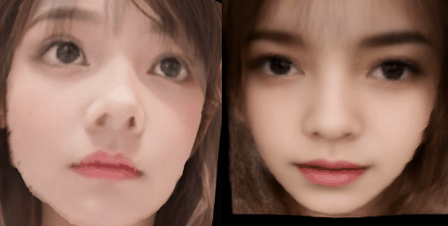

<html lang="ja">
    <head>
        <meta charset="utf-8" />
    </head>
    <body>
        <h1>
3Dポインターとしての人
</h1>
        <h2>なにものか？</h2>
        

            Lightweight-Head-Pose-Estimationを使って3Dモデルを動かすだけのプログラムです。 
             
            ・入力画像(左)から顔を検出し、顔の向きを抽出 
            ・出力画像(右)の向きを変更 
             
        

        <h2>環境構築方法</h2>
        

            <h3>[1] ベース環境をダウンロード～解凍～配置する</h3>
            　<a href="https://github.com/Shaw-git/Lightweight-Head-Pose-Estimation">Lightweight-Head-Pose-Estimation</a> 
            　Code → Download ZIP をクリックする。 
             
              Lightweight-Head-Pose-Estimation-main.zip を解凍し、 
              Lightweight-Head-Pose-Estimation-main フォルダ内のファイル、フォルダを 
              src フォルダの下に配置する。 
             
            <h3>[2] ライブラリをインストールする</h3>
            　・PyTorchをインストールする 
            　　手持ちのGPUの都合でv1.13.0でしか試しておりません。 
            　　<a href="https://pytorch.org/get-started/previous-versions/">https://pytorch.org/get-started/previous-versions/</a> 
            　　v1.13.0 のpip install の手順を参照。 
            　・pip install opencv-python PyOpenGL glfw plyfile pillow 
            　・pip install numpy==1.26.1 
          

        <h2>使い方</h2>
        

            python src\RgbPly_rotated_by_face.py (RGB画像ファイル) (PLYファイル) 
            例) python src\RgbPly_rotated_by_face.py data\rgb1.png data\mesh1.png 
             
            PLYファイルの作り方は<a href="https://github.com/boyoyon/RgbPly"> RgbPly </a>を参照。 
        

    </body>
</html>
